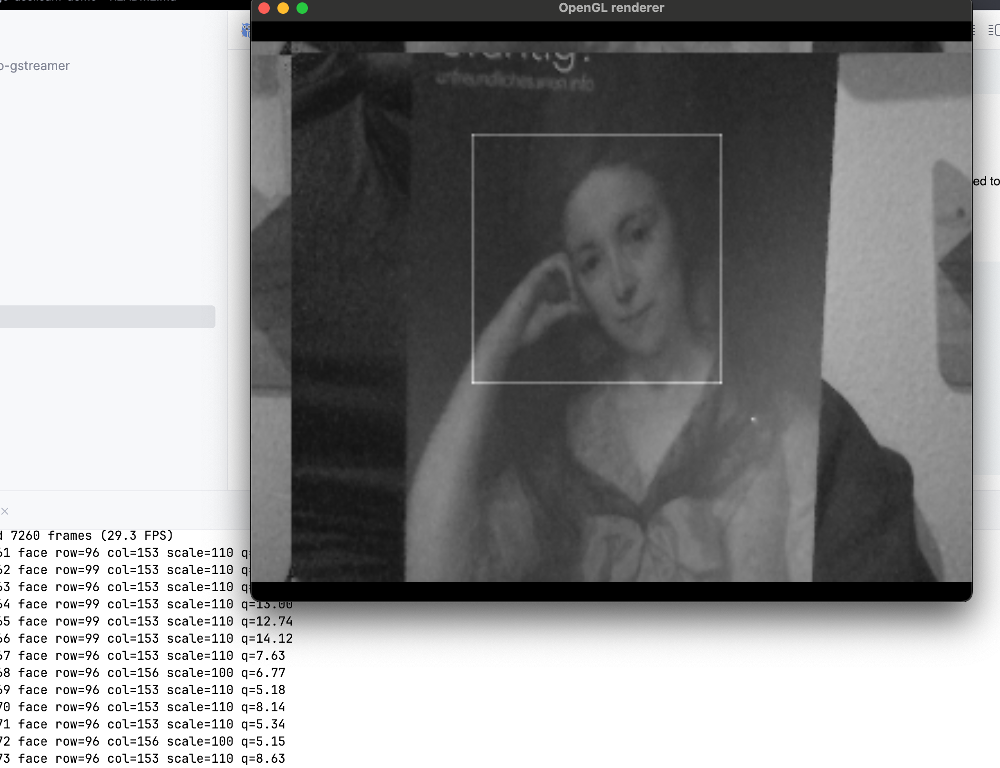

# Pigo + GStreamer demo

Demo app of using [Pigo library](https://github.com/esimov/pigo) for face recognition
with Gstreamer pipeline (no OpenCV needed)

## Build
```shell
go build -o pigo_gstreamer
```

## Run 
The binary `pigo_gstreamer` built in the previous step will  be used as a filter for the upstream pipeline.
The result of it will be passed to the downstream pipeline

**Example on MacOS**
```shell
gst-launch-1.0 -v \
    avfvideosrc device-index=0 ! \
    videoconvert ! videoscale ! \
    video/x-raw,format=GRAY8,width=320,height=240,framerate=30/1 ! \
    fdsink fd=1 sync=false \
    | ./pigo_gstreamer -width=320 -height=240 -cascade=./cascade/facefinder \
    | gst-launch-1.0 -v \
    fdsrc fd=0 blocksize=307200 do-timestamp=true ! \
    videoparse width=320 height=240 format=gray8 framerate=30/1 ! \
    videoconvert ! \
    video/x-raw,format=RGBA,width=320,height=240,framerate=30/1 ! \
    glimagesink sync=false
```

**Result**
